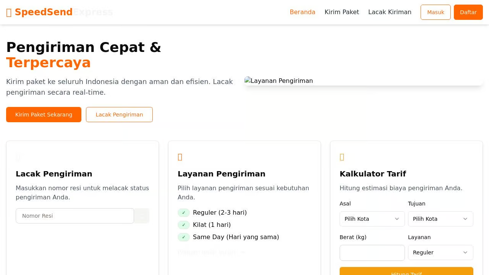

# SpeedSend Express - Shipping & Logistics Application



## Overview

SpeedSend Express is a comprehensive shipping and logistics application that provides end-to-end solutions for package tracking, shipping cost calculation, and order management. Built with modern web technologies, this application aims to streamline the shipping process for both customers and businesses.

## Features

- **Real-time Package Tracking**: Track shipments with detailed event history
- **Shipping Cost Calculator**: Get accurate shipping cost estimates based on weight, distance, and service type
- **User Account Management**: Register, login, and manage your shipping history
- **Multiple Service Options**: Choose from various shipping speeds and service levels
- **Responsive Design**: Fully functional on mobile, tablet, and desktop devices

## Tech Stack

- **Frontend**: React, TypeScript, Tailwind CSS, Shadcn UI
- **Backend**: Node.js, Express
- **Database**: In-memory storage (easily upgradable to PostgreSQL)
- **Authentication**: Passport.js with session-based auth
- **State Management**: TanStack Query (React Query)
- **Form Handling**: React Hook Form with Zod validation

## Getting Started

### Prerequisites

- Node.js (v20 or higher)
- npm or yarn

### Installation

1. Clone the repository
2. Install dependencies:
   ```
   npm install
   ```
3. Start the development server:
   ```
   npm run dev
   ```
4. Open your browser and navigate to `http://localhost:5000`

## Usage Guide

### Tracking a Package
1. Enter your tracking number on the home page or tracking page
2. View detailed shipment information including current status, location, and delivery estimate
3. See the complete history of the shipment's journey

### Creating a New Shipment
1. Log in to your account
2. Navigate to the Shipping page
3. Fill in origin and destination details
4. Enter package information (weight, dimensions)
5. Select desired service type
6. Review cost calculation and confirm shipment

### Managing Your Account
1. Register for a new account or log in to an existing one
2. View your shipment history
3. Update your profile information
4. Review shipping preferences

## API Documentation

The application provides several API endpoints for interacting with the shipping system:

- `/api/user` - User authentication and management
- `/api/shipments` - Shipment creation and retrieval
- `/api/tracking` - Package tracking functionality
- `/api/cities` - City data for shipping calculations
- `/api/rates` - Shipping rate calculations

## Contributing

Contributions are welcome! Please feel free to submit a Pull Request.

## License

This project is licensed under the MIT License - see the LICENSE file for details.

## Contact

For any inquiries, please contact support@speedsendexpress.com